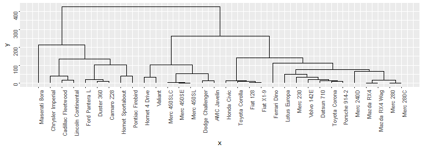

Hierarchical clustering on mtcars
========================================================
author: Massimiliano Figini
date: 2017-03-16
autosize: true

The project
========================================================

"Hierarchical clustering on mtcars" is my app for the third Course Project of the 
Developing Data Product Course, part of the Data Science Specialization by Johns 
Hopkins University on Coursera.

The app allow to perform a hierarchical clustering on the mtcars data.<br/>
The user can choose what cars and what variables will be part of the analysis, and in how
many group the cars will be splitted.

You can find the app at this link:<br/>
<https://massyfigini.shinyapps.io/Hierarchical_Clustering_mtcars/>.


The Data
========================================================
<small>
The mtcars data was extracted from the 1974 Motor Trend US magazine, and comprises fuel consumption and 10 aspects of automobile design and performance for 32 automobiles (1973-74 models). The variables are:
  - mpg: Miles/(US) gallon
  - cyl: Number of cylinders
  - disp: Displacement (cu.in.)
  - hp: Gross horsepower
  - drat: Rear axle ratio
  - wt: Weight (1000 lbs)
  - qsec: 1/4 mile time; vs: V/S
  - am: Transmission (0 = automatic, 1 = manual)
  - gear: Number of forward gears
  - carb: Number of carburetors
</small>

App use
========================================================

In the left part of the webpage, you have two tab:<br/>
- The documentation tab show the instruction for the app use and a description of the data.
- In the input tab, you can choose how many groups the app will split the data, and which variables and which cars will be used for the clustering.

On the right, the cluster and the dendrogram will update at every change.<br/>
By default all the cars and all the variables are selected, and the number of groups is set to 4.nces matrix


Code sample
========================================================
<small>This is the code used for the Hierarchical clustering (default values):</small>

```r
library(datasets);data(mtcars);library(ggdendro)
dscars<-dist(mtcars);hc<-hclust(dscars);tree<-cutree(hc, k=4)
ggdendrogram(hc, theme_dendro = FALSE)
```


<small>For the complete code, go to my Github repository:
<https://github.com/massyfigini/Developing_Data_Products_CP/tree/master/Course_Project_3>
